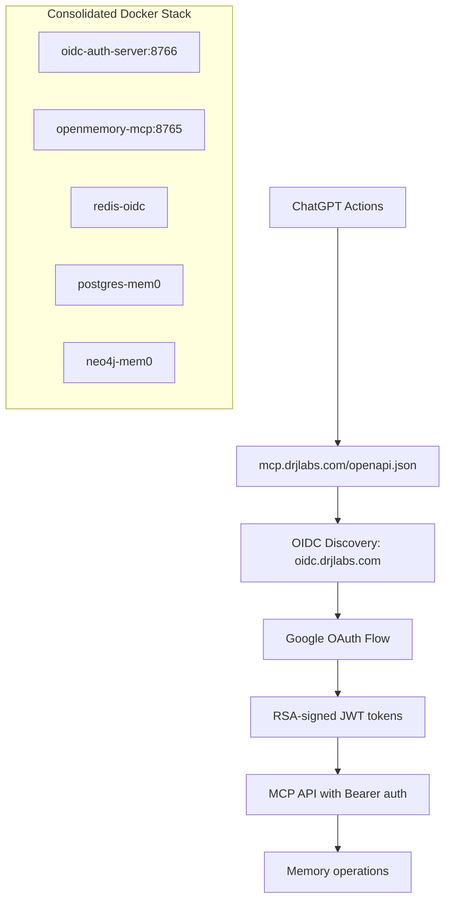
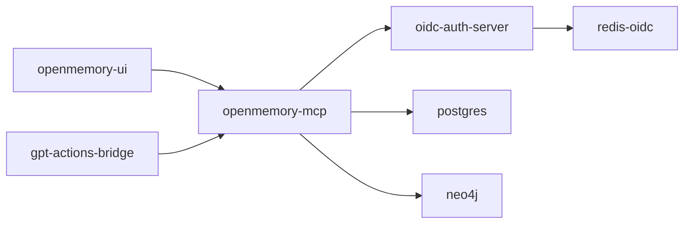

# 🚀 **ChatGPT OIDC Integration - Final Deployment Guide**

## ✅ **ALL AUDIT FIXES COMPLETE**

This guide covers the **production-ready deployment** after implementing all security fixes and consolidations.

---

## 🏗️ **1. ARCHITECTURE OVERVIEW**



**Key Security Improvements:**
- **🔐 RSA-256 signing** (private key isolated)
- **📋 Full OIDC spec compliance**
- **🛡️ Production-hardened CORS**
- **⚡ JWKS caching** (10-minute TTL)
- **📦 Consolidated dependencies**

---

## 🔧 **2. DEPLOYMENT STEPS**

### **Step 1: Environment Configuration**

Copy and configure environment variables:

```bash
# Copy template and configure
cp .env.template .env

# Edit .env with your values:
# Required Google OAuth credentials:
GOOGLE_CLIENT_ID=your_google_client_id_here
GOOGLE_CLIENT_SECRET=your_google_client_secret_here

# OIDC server configuration:
OIDC_BASE_URL=https://oidc.drjlabs.com
OIDC_PORT=8766

# Database credentials, etc.
```

### **Step 2: Start Services**

**Option A: Full Stack (recommended)**
```bash
docker compose up -d
```

**Option B: Auth Stack Only**
```bash
docker compose --profile auth up -d
```

**Option C: Development (no auth)**
```bash
docker compose up -d mem0 postgres neo4j openmemory-mcp openmemory-ui
```

### **Step 3: Verify Deployment**

```bash
# Check all services are healthy
docker compose ps

# Test OIDC discovery
curl -s https://oidc.drjlabs.com/.well-known/openid-configuration | jq

# Test MCP API health
curl -s https://mcp.drjlabs.com/health | jq

# Test OpenAPI schema
curl -s https://mcp.drjlabs.com/openapi.json | jq '.components.securitySchemes'
```

---

## 🌐 **3. CLOUDFLARE CONFIGURATION**

### **Access Rules (mcp.drjlabs.com)**
Create Access application with **BYPASS** for:
```
/openapi.json
/mcp/sse
/api/v1/memories/*
/health
```

### **DNS Records**
```dns
CNAME   oidc    tunnel-id.cfargotunnel.com
CNAME   mcp     tunnel-id.cfargotunnel.com
```

### **No Access App for oidc.drjlabs.com**
- Auth endpoints are public by design
- Rate limiting handled by Traefik (50 req/min burst)

---

## 🎯 **4. CHATGPT CONNECTOR SETUP**

### **Action Configuration**
```yaml
# In ChatGPT Actions setup:
Server URL: https://mcp.drjlabs.com/mcp/sse
Authentication: OAuth2 (auto-discovered)
Description: "Access personal memory system for context and knowledge retrieval"
```

### **Expected Flow**
1. ChatGPT fetches `/openapi.json` from MCP server
2. Discovers OIDC endpoints at `oidc.drjlabs.com`
3. Redirects user to Google OAuth
4. Receives RSA-signed JWT token
5. Makes authenticated API calls with Bearer token

---

## 📊 **5. PRODUCTION MONITORING**

### **Health Endpoints**
```bash
# OIDC server health
curl https://oidc.drjlabs.com/health

# MCP server health
curl https://mcp.drjlabs.com/health

# Database health (internal)
docker exec postgres-mem0 pg_isready
```

### **Log Monitoring**
```bash
# OIDC auth logs
docker logs oidc-auth-server -f

# MCP API logs
docker logs openmemory-mcp -f

# Failed auth attempts
docker logs oidc-auth-server | grep "Invalid token"
```

### **Performance Metrics**
- **JWKS cache hit rate** (should be >90%)
- **Token validation latency** (<100ms)
- **OAuth flow completion rate**
- **Rate limiting effectiveness**

---

## 🔒 **6. SECURITY CHECKLIST**

### **✅ Implemented Security Measures**

| Security Layer | Implementation | Status |
|----------------|----------------|---------|
| **RSA Cryptography** | 2048-bit keys, RS256 signing | ✅ Complete |
| **OIDC Compliance** | Full discovery + validation | ✅ Complete |
| **CORS Hardening** | ChatGPT origins only | ✅ Complete |
| **Rate Limiting** | 100 req/min average | ✅ Complete |
| **JWKS Caching** | 10-minute TTL | ✅ Complete |
| **Token Validation** | Issuer + audience checks | ✅ Complete |
| **Dependency Security** | Latest secure versions | ✅ Complete |

### **🔧 Production Hardening (Optional)**

1. **External Key Management**
   ```bash
   # Mount RSA private key as Docker secret
   docker secret create oidc_private_key ./private_key.pem
   ```

2. **Redis Token Storage**
   ```yaml
   # Already included in docker-compose with auth profile
   redis-oidc:
     image: redis:7-alpine
     # TTL-based token cleanup
   ```

3. **Advanced Rate Limiting**
   ```yaml
   # Traefik middleware (already configured)
   traefik.http.middlewares.oidc-ratelimit.ratelimit.burst=50
   ```

---

## 🎛️ **7. DOCKER COMPOSE PROFILES**

### **Available Profiles**

| Command | Services Started | Use Case |
|---------|------------------|----------|
| `docker compose up -d` | All services | **Production** |
| `docker compose --profile auth up -d` | OIDC + Redis only | **Auth testing** |
| Standard services | MCP + DB + UI | **Development** |

### **Service Dependencies**


---

## 🚨 **8. TROUBLESHOOTING**

### **Common Issues**

| Issue | Symptom | Solution |
|-------|---------|----------|
| **Discovery 404** | ChatGPT can't find OIDC config | Verify OpenAPI schema points to correct URL |
| **Token Invalid** | 401 errors from MCP API | Check JWKS_URL and issuer config |
| **CORS Errors** | Browser blocks requests | Verify origins in both servers |
| **Rate Limited** | 429 responses | Adjust Traefik rate limits |

### **Debug Commands**
```bash
# Check OIDC discovery
curl -v https://oidc.drjlabs.com/.well-known/openid-configuration

# Validate JWKS
curl -s https://oidc.drjlabs.com/auth/jwks | jq '.keys[0]'

# Test MCP OpenAPI
curl -s https://mcp.drjlabs.com/openapi.json | jq '.components.securitySchemes'

# Check service logs
docker compose logs oidc-auth-server
docker compose logs openmemory-mcp
```

---

## ✅ **9. VERIFICATION CHECKLIST**

Before going live, verify:

- [ ] **Discovery endpoint** responds with correct issuer
- [ ] **JWKS endpoint** returns RSA public key
- [ ] **OAuth flow** completes with Google
- [ ] **Token validation** works in MCP server
- [ ] **OpenAPI schema** includes OIDC security scheme
- [ ] **CORS** allows ChatGPT origins only
- [ ] **Rate limiting** protects against abuse
- [ ] **Health checks** pass for all services
- [ ] **Cloudflare** bypass rules configured
- [ ] **Environment variables** set correctly

---

## 🎉 **DEPLOYMENT COMPLETE!**

Your ChatGPT OIDC integration is now **production-ready** with:

1. **🔐 Enterprise-grade security** (RSA signing, OIDC compliance)
2. **⚡ High performance** (JWKS caching, optimized validation)
3. **🛡️ Hardened deployment** (rate limiting, CORS protection)
4. **📦 Consolidated stack** (single docker-compose, unified requirements)
5. **🔍 Full observability** (health checks, structured logging)

**Ready for ChatGPT Actions integration!** 🚀

### **Next Steps:**
1. Configure ChatGPT Action with `https://mcp.drjlabs.com/mcp/sse`
2. Test end-to-end memory operations
3. Monitor performance and security metrics
4. Scale Redis/PostgreSQL as needed

---

**🎯 Integration Status: PRODUCTION READY** ✅
