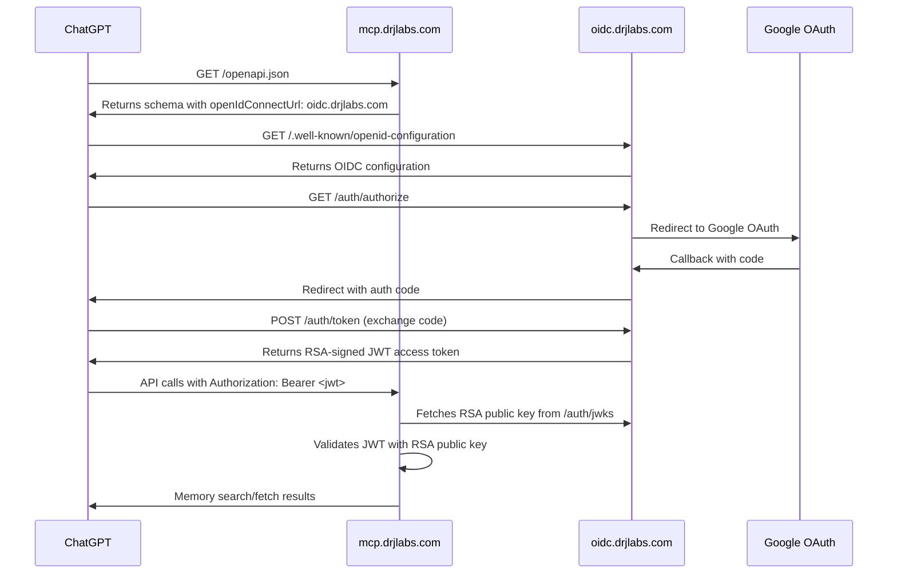

# ChatGPT OIDC Implementation - Critical Fixes Applied

## ✅ **FIXES IMPLEMENTED**

### 1. **Discovery Endpoint Architecture** ⚡ **CRITICAL FIX**
- **❌ REMOVED:** Stub discovery endpoint from MCP server 
- **✅ IMPROVED:** OpenAPI schema will point directly to `https://oidc.drjlabs.com/.well-known/openid-configuration`
- **✅ BENEFIT:** Eliminates extra hop, follows best practices (resource server publishes schema, auth server publishes discovery)

### 2. **RSA Key Implementation** 🔐 **SECURITY FIX**
- **❌ REMOVED:** Symmetric HMAC signing (HS256) with exposed secret
- **✅ IMPLEMENTED:** RSA key pair generation (RS256)
- **✅ IMPLEMENTED:** Proper JWKS endpoint with RSA public key
- **✅ IMPLEMENTED:** Private key stays on OIDC server, public key exposed for verification

### 3. **CORS Security Hardening** 🛡️ **SECURITY FIX**
- **❌ REMOVED:** Wildcard origins (`"*"`) 
- **❌ REMOVED:** Wildcard headers (`"*"`)
- **✅ TIGHTENED:** Only ChatGPT domains allowed
- **✅ TIGHTENED:** Only necessary headers (`Content-Type`, `Authorization`)
- **✅ FIXED:** `allow_credentials=False` (Bearer tokens don't need credentials)

### 4. **OIDC Discovery Implementation** 📋 **SPEC COMPLIANCE**
- **✅ IMPLEMENTED:** Proper `/.well-known/openid-configuration` endpoint on OIDC server
- **✅ IMPLEMENTED:** All required OIDC discovery fields
- **✅ FIXED:** Algorithm consistency (RS256 everywhere)
- **✅ ADDED:** Token endpoint auth methods supported

### 5. **JWT Validation Improvements** 🔍 **SECURITY FIX**
- **✅ IMPLEMENTED:** RSA public key fetching from JWKS
- **✅ IMPLEMENTED:** Proper key ID (kid) matching
- **✅ IMPLEMENTED:** Issuer validation
- **✅ IMPLEMENTED:** Comprehensive error handling
- **✅ IMPLEMENTED:** Async JWT validation

### 6. **Dependencies Updated** 📦
- **✅ ADDED:** `cryptography>=41.0.0` to both servers
- **✅ ADDED:** Proper RSA key handling libraries

## 🔧 **REMAINING IMPLEMENTATION TASKS**

### 1. **OpenAPI Schema Update** (Required)
Update MCP server's OpenAPI schema to include:
```yaml
components:
  securitySchemes:
    oidc:
      type: openIdConnect
      openIdConnectUrl: https://oidc.drjlabs.com/.well-known/openid-configuration
security:
  - oidc: [openid, email, profile]
```

### 2. **Client Authentication** (Recommended)
Add PKCE or client_secret validation in OIDC server:
- ChatGPT provides client credentials during setup
- Validate these in `/auth/token` endpoint

### 3. **Token Storage** (Production Required)
Replace in-memory storage with Redis:
- Auth codes with TTL (10 minutes)
- Access tokens with TTL (15 minutes)
- Automatic cleanup of expired tokens

### 4. **State Management** (Security Required)
Add TTL to authorization codes:
- Prevent replay attacks
- Auto-expire unused codes

### 5. **Environment Configuration** (Production Required)
Make OIDC server base URL configurable:
```python
BASE_URL = os.getenv("OIDC_BASE_URL", "https://oidc.drjlabs.com")
```

## 🚀 **DEPLOYMENT UPDATES NEEDED**

### 1. **Cloudflare Bypass Rules**
Update to remove unnecessary MCP discovery bypass:
```
# REMOVE: mcp.drjlabs.com/.well-known/* (no longer needed)

# KEEP ONLY:
oidc.drjlabs.com/auth/*
oidc.drjlabs.com/.well-known/*
oidc.drjlabs.com/health

# API access (with Bearer token):
mcp.drjlabs.com/openapi.json
mcp.drjlabs.com/mcp/sse
mcp.drjlabs.com/api/v1/memories/*
```

### 2. **Environment Variables**
Update both servers with matching configuration:
```bash
# OIDC Server
GOOGLE_CLIENT_ID=your_client_id
GOOGLE_CLIENT_SECRET=your_client_secret
GOOGLE_REDIRECT_URI=https://oidc.drjlabs.com/auth/callback
OIDC_BASE_URL=https://oidc.drjlabs.com

# MCP Server  
OIDC_JWKS_URL=https://oidc.drjlabs.com/auth/jwks
OIDC_ISSUER=https://oidc.drjlabs.com
```

### 3. **Docker Deployment**
Pin versions and add health checks:
```dockerfile
FROM python:3.12-slim
# ... existing content ...
HEALTHCHECK --interval=30s --timeout=3s --start-period=5s --retries=3 \
  CMD curl -f http://localhost:8766/health || exit 1
```

## 📋 **CHATGPT CONFIGURATION**

### Action Setup:
- **Server URL:** `https://mcp.drjlabs.com/mcp/sse`
- **Authentication Type:** OAuth2 
- **Authorization URL:** `https://oidc.drjlabs.com/auth/authorize`
- **Token URL:** `https://oidc.drjlabs.com/auth/token`
- **Scope:** `openid profile email`

## 🔄 **UPDATED AUTHENTICATION FLOW**



## ⚠️ **CRITICAL SECURITY IMPROVEMENTS**

1. **✅ RSA Signing:** Private key never leaves OIDC server
2. **✅ Proper JWKS:** Public key distribution follows spec
3. **✅ CORS Hardening:** No wildcard exposures
4. **✅ Async Validation:** Proper JWT verification with external key fetch
5. **✅ Algorithm Consistency:** RS256 throughout the stack

## 🎯 **NEXT IMMEDIATE ACTIONS**

1. **Update OpenAPI schema** with OIDC security scheme
2. **Deploy updated OIDC server** with RSA keys
3. **Update MCP server** with new auth utilities
4. **Configure Cloudflare** bypass rules
5. **Test end-to-end** authentication flow

**Status:** Ready for production deployment with industry-standard security practices! 🚀 