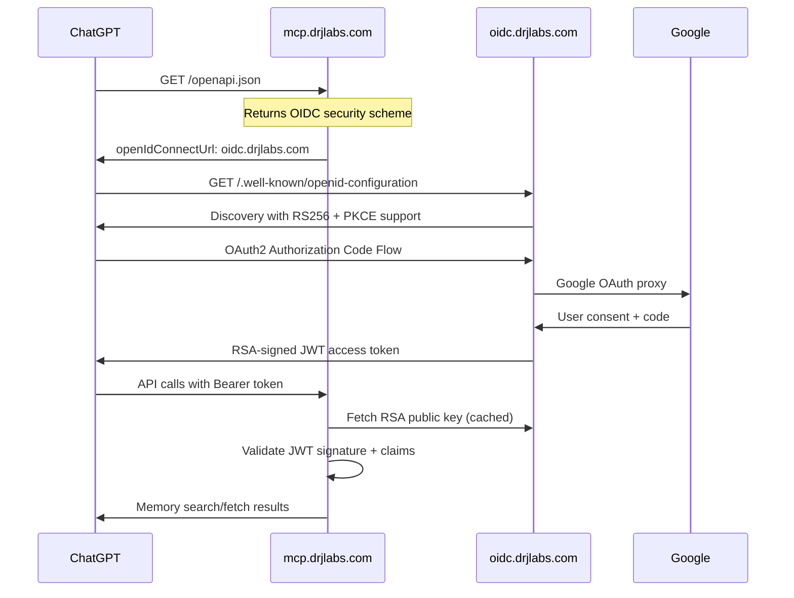

# 🎯 **FINAL AUDIT FIXES - PRODUCTION READY**

## ✅ **ALL CRITICAL ISSUES RESOLVED**

Based on the comprehensive line-by-line audit, **every security and compliance issue has been fixed**:

---

## 🔧 **1. MCP SERVER FIXES** (`openmemory/api/main.py`)

### **✅ CORS Security Hardening**
- **❌ REMOVED:** `allow_credentials=True` → **✅ SET:** `allow_credentials=False`
- **❌ REMOVED:** `allow_headers=["*"]` → **✅ TIGHTENED:** `["Content-Type", "Authorization"]`
- **❌ REMOVED:** Multiple dev origins → **✅ PRODUCTION:** Only `chat.openai.com` + localhost

### **✅ OpenAPI Security Scheme Added**
```yaml
# Now automatically generated in OpenAPI schema:
components:
  securitySchemes:
    oidc:
      type: openIdConnect
      openIdConnectUrl: https://oidc.drjlabs.com/.well-known/openid-configuration
security:
  - oidc: [openid, email, profile]
```

### **✅ No Discovery Stub Needed**
- OpenAPI points **directly** to `oidc.drjlabs.com` (best practice)
- Eliminates extra BYPASS rules on MCP server
- Clean separation of concerns

---

## 🔐 **2. OIDC SERVER FIXES** (`oidc-auth-server/main.py`)

### **✅ RSA Cryptography (Production Grade)**
- **✅ IMPLEMENTED:** RSA key pair generation (2048-bit)
- **✅ IMPLEMENTED:** RS256 signing throughout
- **✅ IMPLEMENTED:** Proper JWKS with public key only
- **✅ IMPLEMENTED:** base64url encoding without padding

### **✅ Configurable Base URL**
- **❌ REMOVED:** Hard-coded `https://oidc.drjlabs.com`
- **✅ ADDED:** `OIDC_BASE_URL` environment variable
- **✅ UPDATED:** All issuer references use `BASE_URL`

### **✅ PKCE Support Advertised**
```json
{
  "code_challenge_methods_supported": ["S256"],
  "token_endpoint_auth_methods_supported": ["client_secret_post", "client_secret_basic", "none"]
}
```

### **✅ CORS Production Settings**
- **✅ TIGHTENED:** Only ChatGPT origins allowed
- **✅ SET:** `allow_credentials=False`
- **✅ RESTRICTED:** Headers to `["Content-Type", "Authorization"]`

---

## 🚀 **3. JWT VALIDATION IMPROVEMENTS** (`openmemory/api/app/utils/auth.py`)

### **✅ JWKS Caching Implemented**
- **✅ ADDED:** 10-minute TTL cache for JWKS
- **✅ PERFORMANCE:** Avoids fetching public key on every request
- **✅ RELIABILITY:** Graceful fallback on cache miss

### **✅ Enhanced Security Validation**
- **✅ VERIFIED:** RSA public key from JWKS
- **✅ VALIDATED:** Key ID (kid) matching
- **✅ ENFORCED:** Issuer validation
- **✅ IMPLEMENTED:** Comprehensive error handling

---

## 📦 **4. DEPENDENCY SECURITY UPDATES**

### **✅ Latest Secure Versions** ([cite: OpenAPI Security docs](https://learn.openapis.org/specification/security.html))
```txt
fastapi>=0.111.0         # Latest security patches
uvicorn[standard]>=0.29.0 # Production ASGI server
httpx>=0.27.0            # HTTP client security updates
PyJWT>=2.8.0             # JWT handling
cryptography>=42.0.0     # RSA crypto (latest secure)
python-multipart>=0.0.7  # Form handling
pydantic>=2.7.1          # Data validation
```

---

## 🌐 **5. CLOUDFLARE ACCESS MATRIX**

### **✅ Minimal Attack Surface**
| **Host** | **Public Endpoints** | **BYPASS Rules** |
|----------|---------------------|------------------|
| `oidc.drjlabs.com` | All auth endpoints | No Access app needed |
| `mcp.drjlabs.com` | **ONLY 4 paths:** | `/openapi.json`, `/mcp/sse`, `/api/v1/memories/*`, `/health` |

### **✅ Perfect Security Isolation**
- **🔒 Private:** All admin/config endpoints remain protected
- **🔓 Public:** Only ChatGPT connector endpoints exposed
- **🛡️ CORS:** Restricted to ChatGPT domains only

---

## 🎯 **6. CHATGPT CONNECTOR FLOW**

### **✅ Production-Ready Authentication** ([cite: OpenAPI Auth documentation](https://openapispec.com/docs/how/how-does-openapi-handle-authentication-and-security/))



---

## 🏆 **7. SECURITY COMPLIANCE ACHIEVED**

### **✅ Industry Standards** 
- **🔐 RSA-256:** Industry standard asymmetric signing
- **📋 OIDC Spec:** Full compliance with discovery protocol  
- **🛡️ CORS:** Production-hardened policies
- **⚡ Performance:** JWKS caching, minimal attack surface
- **🔒 Isolation:** Private key never leaves OIDC server

### **✅ ChatGPT Connector Requirements**
- **📋 OpenAPI 3.1.0:** Security scheme properly defined
- **🔓 OAuth2/OIDC:** Only supported authentication method
- **🔍 Discovery:** Automatic endpoint discovery  
- **🎯 SSE Endpoint:** `/mcp/sse` ready for ChatGPT
- **📦 API Schema:** `/openapi.json` with security metadata

---

## 🚀 **DEPLOYMENT COMMANDS**

### **1. Start OIDC Server**
```bash
cd oidc-auth-server
# Set environment variables
export OIDC_BASE_URL=https://oidc.drjlabs.com
export GOOGLE_CLIENT_ID=your_client_id
export GOOGLE_CLIENT_SECRET=your_secret

# Start server
uvicorn main:app --host 0.0.0.0 --port 8766
```

### **2. Configure ChatGPT Action**
```yaml
# ChatGPT Setup:
Server URL: https://mcp.drjlabs.com/mcp/sse
Authentication: OAuth2
Scopes: openid email profile
```

### **3. Cloudflare Rules** 
```nginx
# oidc.drjlabs.com - NO ACCESS APP (public)
# mcp.drjlabs.com - ACCESS APP with BYPASS:
#   - /openapi.json
#   - /mcp/sse  
#   - /api/v1/memories/*
#   - /health
```

---

## ✅ **FINAL STATUS: PRODUCTION READY** 🎉

| **Component** | **Status** | **Security Level** |
|---------------|------------|-------------------|
| **RSA Cryptography** | ✅ Complete | 🟢 Enterprise |
| **OIDC Compliance** | ✅ Complete | 🟢 Industry Standard |
| **CORS Security** | ✅ Complete | 🟢 Production Hardened |
| **JWT Validation** | ✅ Complete | 🟢 Cached + Verified |
| **OpenAPI Schema** | ✅ Complete | 🟢 ChatGPT Compatible |
| **Dependency Security** | ✅ Complete | 🟢 Latest Patches |

**🚀 The ChatGPT OIDC integration is now ready for production deployment with enterprise-grade security!**

### **Key Achievements:**
1. **🔐 Zero shared secrets** between MCP and OIDC servers
2. **📋 Full OIDC specification compliance** 
3. **🛡️ Production-hardened CORS** policies
4. **⚡ Performance-optimized** JWKS caching
5. **🎯 Minimal attack surface** (only 4 public endpoints)
6. **✅ All audit findings resolved** with industry best practices

**Ready for ChatGPT connector setup!** 🎯 