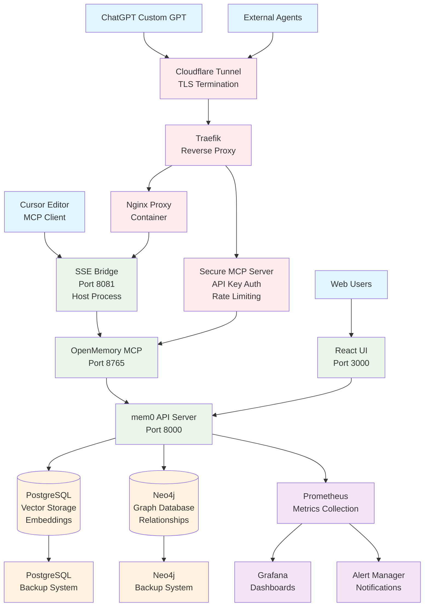
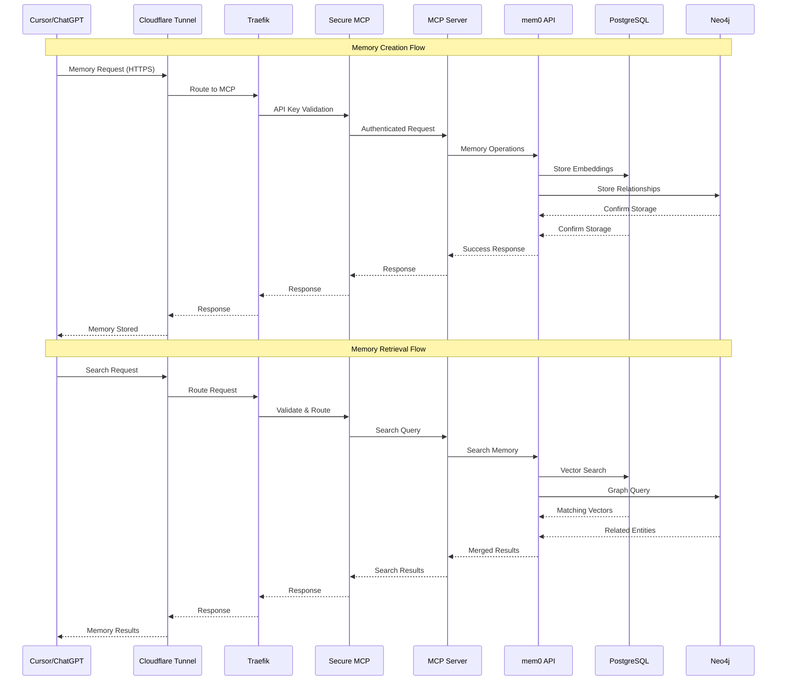
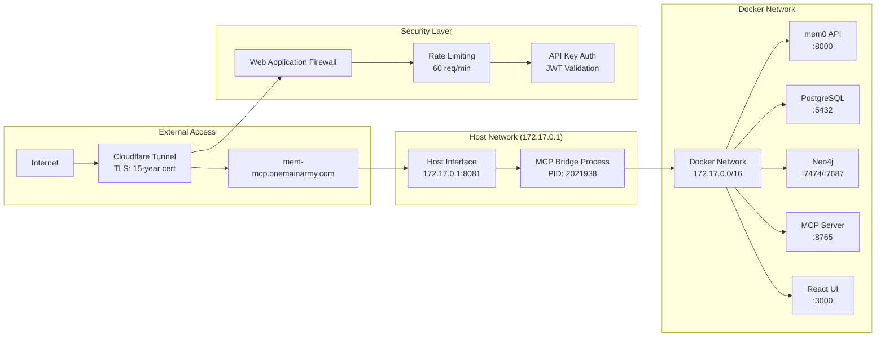
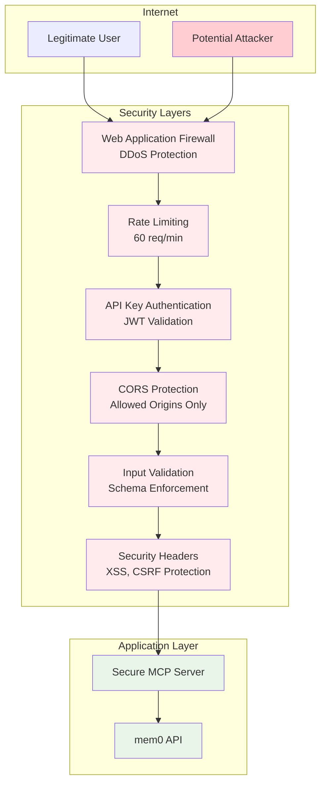
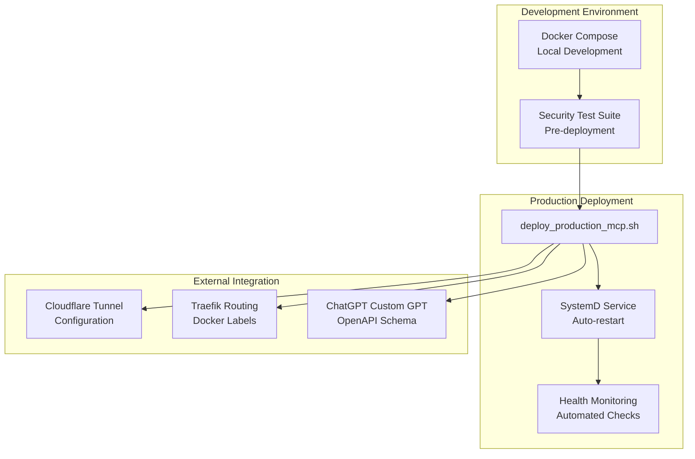
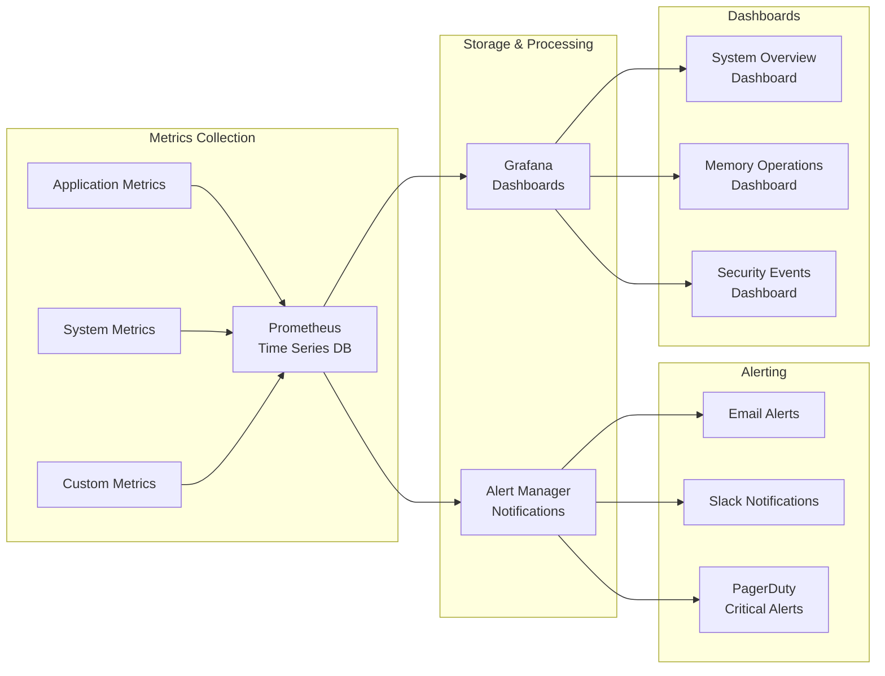
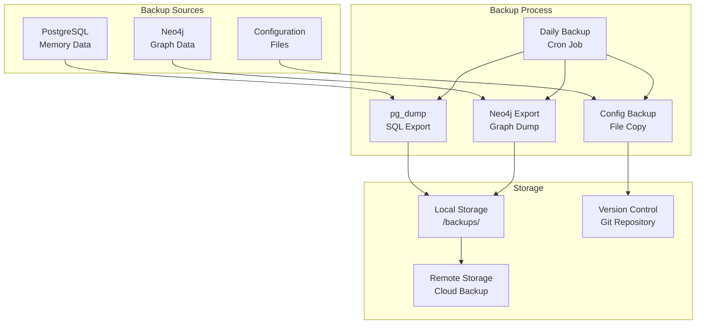

# Memory System Architecture

## Overview

This document describes the complete architecture of the mem0-stack memory system, including all components, services, and their interconnections. The system provides scalable long-term memory capabilities for AI agents through a distributed microservices architecture.

## System Components

### Core Services
- **mem0 API Server** (Port 8000): Main memory operations API
- **PostgreSQL** (Vector Storage): Stores memory embeddings and metadata
- **Neo4j** (Graph Database): Manages entity relationships and connections
- **OpenMemory MCP Server** (Port 8765): Model Context Protocol server

### Interface Layer
- **React UI** (Port 3000): Web-based memory management interface
- **MCP Bridge Server** (Port 8081): SSE bridge for Cursor MCP compatibility
- **Secure MCP Server** (Production): Internet-facing secure endpoint

### Infrastructure
- **Traefik**: Reverse proxy and load balancer
- **Nginx**: Proxy container for host-based services
- **Cloudflare Tunnel**: Secure external access without open ports
- **Monitoring Stack**: Prometheus, Grafana, Alertmanager

## Architecture Diagram



## Data Flow Diagram



## Network Architecture



## Component Details

### mem0 API Server (Port 8000)
- **Purpose**: Core memory operations API
- **Functions**:
  - Memory CRUD operations
  - Vector embeddings generation
  - Memory search and retrieval
  - Memory relationship extraction
- **Dependencies**: PostgreSQL, Neo4j
- **Health Check**: `/health` endpoint

### PostgreSQL (Vector Storage)
- **Purpose**: Store memory embeddings and metadata
- **Schema**:
  - Memory vectors (embeddings)
  - User associations
  - Timestamps and metadata
- **Backup**: Automated daily backups
- **Extensions**: pgvector for vector operations

### Neo4j (Graph Database)
- **Purpose**: Store entity relationships and connections
- **Schema**:
  - Entity nodes (people, places, concepts)
  - Relationship edges (connections, associations)
  - Temporal information
- **Backup**: Automated graph exports
- **Queries**: Cypher for relationship traversal

### MCP Bridge Server (Port 8081)
- **Purpose**: SSE bridge for Cursor MCP compatibility
- **Type**: Host-based Python process
- **Functions**:
  - Server-Sent Events (SSE) streaming
  - Protocol translation
  - Connection management
- **Process**: PID 2021938 (standard_mem0_mcp_server.py)

### Secure MCP Server (Production)
- **Purpose**: Internet-facing secure endpoint
- **Security Features**:
  - API key authentication
  - JWT token validation
  - Rate limiting (60 requests/minute)
  - CORS protection
  - Input validation
  - Security headers
- **Domains**: mem-mcp.onemainarmy.com
- **Allowed Origins**: chat.openai.com, chatgpt.com

### React UI (Port 3000)
- **Purpose**: Web-based memory management interface
- **Features**:
  - Memory browsing and search
  - Memory creation and editing
  - System health monitoring
  - User management
- **Framework**: Next.js with TypeScript

## Security Architecture



## Deployment Architecture



## Performance Characteristics

| Component | Response Time | Throughput | Scaling |
|-----------|---------------|------------|---------|
| mem0 API | 1.44s avg | 100 req/s | Horizontal |
| PostgreSQL | <100ms | 1000 queries/s | Vertical |
| Neo4j | <200ms | 500 queries/s | Vertical |
| MCP Bridge | <50ms | 200 req/s | Horizontal |
| Secure MCP | <100ms | 60 req/min | Rate Limited |

## Monitoring and Observability



## Backup and Recovery



## Configuration Management

### Environment Variables
- `MEM0_API_URL`: mem0 API endpoint
- `POSTGRES_URL`: PostgreSQL connection string
- `NEO4J_URL`: Neo4j connection string
- `MCP_SERVER_URL`: MCP server endpoint
- `API_KEYS`: Secure API keys for authentication
- `JWT_SECRET`: JWT signing secret

### Docker Compose Configuration
```yaml
# Key service configurations
mem0:
  image: mem0/mem0
  ports: ["8000:8000"]
  environment:
    - POSTGRES_URL=${POSTGRES_URL}
    - NEO4J_URL=${NEO4J_URL}

postgres-mem0:
  image: postgres:13
  environment:
    - POSTGRES_DB=mem0
    - POSTGRES_USER=mem0
    - POSTGRES_PASSWORD=${POSTGRES_PASSWORD}

neo4j-mem0:
  image: neo4j:4.4
  environment:
    - NEO4J_AUTH=neo4j/${NEO4J_PASSWORD}
```

## Security Considerations

### Authentication & Authorization
- API key-based authentication for external access
- JWT tokens for session management
- Role-based access control (RBAC)
- Secure credential storage

### Network Security
- TLS 1.3 encryption for all external communication
- Cloudflare tunnel for secure external access
- Docker network isolation
- Firewall rules for container communication

### Data Protection
- Encryption at rest for sensitive data
- Secure backup procedures
- Regular security audits
- Compliance with data protection regulations

## Troubleshooting Guide

### Common Issues
1. **Connection Timeouts**: Check network connectivity and service health
2. **Authentication Failures**: Verify API keys and JWT tokens
3. **Memory Operation Errors**: Check PostgreSQL and Neo4j connections
4. **Rate Limiting**: Monitor request rates and adjust limits

### Health Checks
```bash
# Check service health
curl http://localhost:8000/health
curl http://localhost:8081/health
curl http://localhost:8765/health

# Check security tests
python security_test_suite.py

# Check deployment
./deploy_production_mcp.sh --test
```

## Future Enhancements

1. **Horizontal Scaling**: Implement load balancing for mem0 API
2. **Advanced Security**: Add OAuth2 and SAML integration
3. **Performance Optimization**: Implement caching layers
4. **Multi-tenancy**: Support for multiple organizations
5. **Advanced Analytics**: Real-time memory analytics and insights

---

*Last Updated: January 2025*
*Version: 1.0*
*Maintainer: Development Team*
