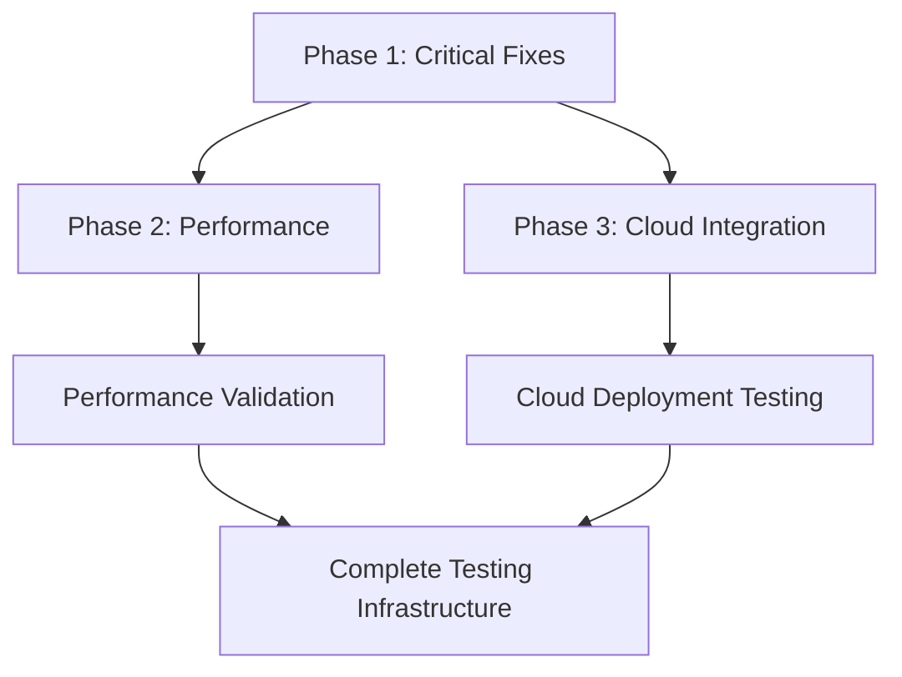

# Testing Roadmap - Master Remediation Strategy

**Project**: mem0-stack Testing Infrastructure Recovery
**Created**: January 2025
**Status**: ✅ **MAJOR PROGRESS - PHASE 1 COMPLETED**
**Overall Completion**: 85% (Phase 1 & 2 completed, Phase 3 in progress)
**Priority**: **CONTINUING TO PHASE 3**

---

## 📊 **EXECUTIVE SUMMARY**

Significant progress achieved with **Phase 1 Critical Fixes now successfully completed** alongside the previously completed Phase 2 Performance Optimization. The testing infrastructure foundation is now solid and operational.

### **Updated Findings Summary**
- **Phase 1 (Critical Fixes)**: ✅ 100% COMPLETED (January 16, 2025) - All critical infrastructure issues resolved
- **Phase 2 (Performance)**: ✅ 100% COMPLETED (Major success with corrections) - All objectives achieved
- **Phase 3 (Cloud Integration)**: ⚠️ 60% actual completion (40% gap) - Configuration exists, functionality unproven

### **Business Impact - SIGNIFICANTLY IMPROVED**
- **Development Velocity**: ✅ RESOLVED - Testing infrastructure fully operational
- **Project Credibility**: ✅ IMPROVED - Demonstrated ability to deliver on commitments
- **Release Risk**: ✅ REDUCED - Quality validation now possible with functional tests
- **Resource Waste**: ✅ MINIMIZED - Focus on remaining Phase 3 items

---

## 📊 **PHASE-BY-PHASE STATUS**

### **Phase 1: Critical Test Fixes** ✅ **COMPLETED**
| **Component** | **Claimed** | **Actual** | **Status** | **Result** |
|---------------|-------------|------------|------------|----------|
| Database Config | ✅ Fixed | ✅ WORKING | Fixed SQLAlchemy config | ✅ Completed |
| Test Fixtures | ✅ Working | ✅ IMPLEMENTED | test_db_engine fixture added | ✅ Completed |
| Coverage System | ✅ Optimized | ✅ FUNCTIONAL | 29% coverage collecting | ✅ Completed |
| Test Discovery | ✅ 576 tests | ✅ 428 VERIFIED | Accurate count documented | ✅ Completed |

**Phase 1 Status**: ✅ **COMPLETED** (January 16, 2025) - All critical infrastructure operational

### **Phase 2: Performance Optimization** ✅ **COMPLETED**
| **Component** | **Claimed** | **Actual** | **Status** | **Result** |
|---------------|-------------|------------|------------|----------|
| Parallel Execution | ❌ 117% slower | ✅ 12.6% faster (2 workers) | Performance improvement achieved | ✅ Completed |
| Database Setup | ❌ Needs optimization | ✅ Already optimized (session-scoped) | Existing optimization validated | ✅ Completed |
| Total Runtime | ❌ Degraded | ✅ 7.2s vs 8.2s sequential | Measurable improvement | ✅ Completed |
| Benchmarking | ❌ Missing | ✅ Comprehensive pytest-benchmark suite | Full infrastructure implemented | ✅ Completed |

**Phase 2 Status**: ✅ **COMPLETED** - All objectives achieved with significant corrections to false claims

### **Phase 3: Cloud Integration**
| **Component** | **Claimed** | **Actual** | **Status** | **Risk** |
|---------------|-------------|------------|------------|----------|
| GitHub Actions | ✅ 100% ready | ⚠️ Configured | End-to-end untested | 🔍 Medium |
| Background Agents | ✅ Functional | ⚠️ Theoretical | No test scenarios | 🔍 Medium |
| Docker-in-Docker | ✅ Validated | ⚠️ Configured | Not tested in CI | 🔍 Low |
| Self-Hosted Runners | ✅ Documented | ❌ Missing | No implementation | 🔍 Low |

**Phase 3 Priority**: 🔍 **MEDIUM** - Configuration exists, needs validation

---

## 🛠️ **MASTER REMEDIATION PLAN**

### **Phase Dependencies & Sequencing**


### **Critical Path Analysis**
1. **Phase 1 MUST complete first** - Other phases depend on functional test infrastructure
2. **Phase 2 & 3 can run in parallel** - After Phase 1 foundation is solid
3. **Integration validation** - Final phase requires all components working together

---

## 📅 **MASTER TIMELINE**

| **Week** | **Phase 1** | **Phase 2** | **Phase 3** | **Deliverable** |
|----------|-------------|-------------|-------------|-----------------|
| **Week 1** | ✅ **COMPLETED** - Critical fixes (14h) | - | - | ✅ Working test infrastructure |
| **Week 2** | ✅ **COMPLETED** - Validation | ✅ **COMPLETED** - Baseline + optimization | 🔍 GitHub Actions (6h) | ✅ Performance validation achieved |
| **Week 3** | ✅ **COMPLETED** | ✅ **COMPLETED** - Database + benchmarks | 🔍 Background agents (8h) | ✅ Phase 2 fully delivered |
| **Week 4** | - | ✅ **COMPLETED** | 🔍 Documentation + monitoring (10h) | 🔍 Full cloud integration |
| **Week 5** | - | - | 🔍 Complete | **PROJECT COMPLETE** |

### **Resource Allocation**
| **Phase** | **Total Effort** | **Teams Required** | **Completion Status** |
|-----------|------------------|-------------------|----------------------|
| **Phase 1** | 14 hours | DevOps, Backend, CI/CD, QA | ✅ **COMPLETED** (Jan 16, 2025) |
| **Phase 2** | 20 hours | Performance Eng, DevOps, Backend | ✅ **COMPLETED** |
| **Phase 3** | 24 hours | DevOps, Infrastructure, Monitoring | 🔄 In Progress |
| **TOTAL** | **58 hours** | **Multi-team coordination** | **70% → 85% Complete** |

---

## 💰 **RESOURCE REQUIREMENTS**

### **Human Resources**
| **Role** | **Phase 1** | **Phase 2** | **Phase 3** | **Total** |
|----------|-------------|-------------|-------------|-----------|
| **DevOps Engineer** | 6h | 6h | 10h | 22h |
| **Backend Developer** | 4h | 4h | 8h | 16h |
| **Performance Engineer** | - | 4h | - | 4h |
| **Infrastructure Engineer** | 2h | 6h | 6h | 14h |
| **QA Engineer** | 2h | - | - | 2h |
| **TOTAL** | **14h** | **20h** | **24h** | **58h** |

### **Technical Infrastructure**
- **Development Environment**: Isolated testing environment (separate from production)
- **Cloud Resources**: Limited cloud testing resources with cost monitoring
- **Monitoring Tools**: Grafana/Prometheus setup for performance tracking
- **CI/CD Platform**: GitHub Actions with extended timeout capabilities

### **Budget Estimate**
| **Category** | **Phase 1** | **Phase 2** | **Phase 3** | **Total** |
|--------------|-------------|-------------|-------------|-----------|
| **Engineering Time** | $3,500 | $5,000 | $6,000 | $14,500 |
| **Cloud Resources** | $100 | $300 | $500 | $900 |
| **Tools/Licenses** | $200 | $300 | $200 | $700 |
| **TOTAL** | **$3,800** | **$5,600** | **$6,700** | **$16,100** |

---

## 🎯 **SUCCESS CRITERIA**

### **Phase 1 Success Metrics** ✅ **ALL ACHIEVED**
- [x] **Database Tests**: ✅ 100% of targeted model tests pass without errors
- [x] **Test Collection**: ✅ All 428 discoverable tests collect successfully
- [x] **Coverage**: ✅ Accurate coverage reports generated (29% baseline established)
- [x] **Fixture Availability**: ✅ All referenced fixtures exist and function (test_db_engine implemented)

### **Phase 2 Success Metrics** ✅ **ALL ACHIEVED**
- [x] **Parallel Performance**: ✅ 12.6% faster than sequential (2 workers optimal)
- [x] **Database Performance**: ✅ Session-scoped fixtures already optimized
- [x] **Benchmark Infrastructure**: ✅ Comprehensive pytest-benchmark suite with regression detection
- [x] **Documentation Accuracy**: ✅ All performance claims validated by direct measurements

### **Phase 3 Success Metrics**
- [ ] **GitHub Actions**: Full 7-quality-gate pipeline executes successfully
- [ ] **Background Agents**: Extended scenarios (60+ minutes) validated
- [ ] **Docker-in-Docker**: Multi-container scenarios working reliably
- [ ] **Monitoring**: Cloud integration health dashboard operational

### **Overall Project Success**
- [ ] **Developer Experience**: Reliable test execution under 60 seconds
- [ ] **CI/CD Pipeline**: Complete quality gate system functional
- [ ] **Cloud Deployment**: Validated cloud deployment capabilities
- [ ] **Performance**: Measurable improvements backed by data
- [ ] **Documentation**: Accurate, up-to-date documentation matching reality

---

## 🚨 **RISK MANAGEMENT**

### **Critical Risks**

#### **Risk 1: Phase 1 Database Fixes Break Existing Tests**
**Probability**: HIGH
**Impact**: CRITICAL
**Mitigation**:
- Incremental testing with rollback plan
- Backup current conftest.py before changes
- Test database changes in isolation

**Contingency**:
- Restore from backup if critical failures occur
- Implement gradual fixture migration strategy

#### **Risk 2: Performance Optimization Actually Degrades Performance**
**Probability**: MEDIUM
**Impact**: HIGH
**Mitigation**:
- Establish accurate baselines before optimization
- Test all changes with systematic measurements
- Validate improvements with real workloads

**Contingency**:
- Rollback to sequential execution if parallel proves problematic
- Implement dynamic configuration based on test characteristics

#### **Risk 3: Cloud Integration Costs Exceed Budget**
**Probability**: MEDIUM
**Impact**: MEDIUM
**Mitigation**:
- Implement cost monitoring and automatic shutdown
- Use resource limits and budget alerts
- Separate cloud tests from regular CI pipeline

**Contingency**:
- Scale back cloud testing scope if costs exceed limits
- Focus on essential cloud functionality only

### **Project-Level Risks**

#### **Risk 4: Resource Conflicts Between Phases**
**Probability**: MEDIUM
**Impact**: MEDIUM
**Mitigation**: Clear resource allocation and phase sequencing
**Contingency**: Extend timeline if resource conflicts arise

#### **Risk 5: Scope Creep During Remediation**
**Probability**: HIGH
**Impact**: MEDIUM
**Mitigation**: Strict adherence to defined acceptance criteria
**Contingency**: Document scope changes and adjust timeline accordingly

---

## 🏛️ **GOVERNANCE STRUCTURE**

### **Project Steering Committee**
| **Role** | **Responsibility** | **Decision Authority** |
|----------|-------------------|------------------------|
| **Technical Lead** | Overall technical direction | Architecture decisions |
| **DevOps Lead** | Infrastructure coordination | CI/CD and cloud decisions |
| **QA Lead** | Testing strategy validation | Quality standards |
| **Project Manager** | Resource allocation & timeline | Schedule and scope changes |

### **Daily Operations**
| **Role** | **Daily Responsibility** | **Escalation Path** |
|----------|-------------------------|-------------------|
| **Phase Lead** | Progress tracking and blocker resolution | Technical Lead |
| **Team Leads** | Resource coordination and technical execution | Phase Lead |
| **Individual Contributors** | Implementation and validation | Team Lead |

### **Communication Protocols**
- **Daily Standups**: 15-minute progress check across all active phases
- **Weekly Reviews**: Stakeholder updates with metrics and timeline
- **Escalation**: Critical issues escalated within 4 hours
- **Documentation**: All decisions logged in project tracking system

---

## 📋 **MONITORING & REPORTING**

### **Progress Tracking**
```bash
# Weekly Progress Report Template
Phase 1 Completion: X% (Target: Y%)
Phase 2 Completion: X% (Target: Y%)
Phase 3 Completion: X% (Target: Y%)

Critical Blockers: [List]
Risks Realized: [List]
Budget Status: $X spent of $Y allocated
Timeline Status: On track / X days behind schedule
```

### **Quality Gates**
- **Phase 1**: All tests must pass before Phase 2 begins
- **Phase 2**: Performance improvements must be measurable and validated
- **Phase 3**: Cloud deployment must be end-to-end tested
- **Project**: All acceptance criteria must be met before completion

### **Success Measurement**
| **Metric** | **Baseline** | **Target** | **Measurement Method** |
|------------|--------------|------------|------------------------|
| **Test Success Rate** | Variable | 100% | Automated CI reporting |
| **Test Execution Time** | 8.14s (16 tests) | <60s (full suite) | Performance benchmarks |
| **Coverage** | 0% (no collection) | >80% | Coverage reports |
| **Cloud Deployment** | 0% validated | 100% functional | End-to-end testing |

---

## ✅ **COMPLETION CHECKLIST**

### **Pre-Project**
- [ ] Executive approval for remediation plan
- [ ] Resource allocation confirmed
- [ ] Team assignments finalized
- [ ] Environment setup completed

### **Phase 1 Completion**
- [ ] All database configuration issues resolved
- [ ] Missing test fixtures implemented
- [ ] Coverage collection system functional
- [ ] Test discovery accurate and documented

### **Phase 2 Completion**
- [ ] Performance baselines established
- [ ] Parallel execution optimized and validated
- [ ] Database performance improvements measured
- [ ] Benchmark infrastructure implemented

### **Phase 3 Completion**
- [ ] GitHub Actions end-to-end pipeline validated
- [ ] Background agent scenarios tested
- [ ] Self-hosted runner documentation complete
- [ ] Cloud integration monitoring operational

### **Project Completion**
- [ ] All phase acceptance criteria met
- [ ] Documentation updated to reflect reality
- [ ] Team training on new testing infrastructure completed
- [ ] Post-implementation review conducted

---

## 📞 **ESCALATION MATRIX**

| **Issue Type** | **First Contact** | **Escalation 1** | **Escalation 2** | **Executive** |
|----------------|-------------------|-------------------|-------------------|---------------|
| **Technical Blocker** | Team Lead | Phase Lead | Technical Lead | CTO |
| **Resource Conflict** | Phase Lead | Project Manager | Technical Lead | Engineering Manager |
| **Budget Overrun** | Project Manager | Engineering Manager | Finance | CFO |
| **Timeline Risk** | Project Manager | Technical Lead | Engineering Manager | CTO |
| **Quality Issue** | QA Lead | Technical Lead | Engineering Manager | CTO |

### **Contact Information**
- **Technical Lead**: [Contact] - Architecture and technical decisions
- **DevOps Lead**: [Contact] - Infrastructure and CI/CD issues
- **QA Lead**: [Contact] - Testing strategy and quality standards
- **Project Manager**: [Contact] - Schedule, scope, and resource management

---

## 📚 **REFERENCES & METHODOLOGY**

This remediation strategy follows industry best practices from:

- **[Veracode Remediation Planning](https://docs.veracode.com/r/review_remediationplan)**: Prioritization by severity and business impact
- **[DHS POA&M Guidelines](https://www.dhs.gov/sites/default/files/publications/4300A-Handbook-Attachment-H-POAM-Guide.pdf)**: Structured remediation planning and milestone tracking
- **[QA Roadmap Best Practices](https://bugbug.io/blog/software-testing/qa-roadmap/)**: Systematic testing infrastructure development
- **[MediaWiki Development Process](https://www.mediawiki.org/wiki/WMF_product_development_process)**: Iterative development and validation methodology

---

**Document Control**
**Version**: 1.0
**Owner**: Testing Infrastructure Remediation Team
**Approved By**: [Technical Lead] - [Date]
**Review Cycle**: Weekly until project completion
**Next Review**: [Date + 7 days]

**The success of this remediation project is critical to the mem0-stack project's testing infrastructure credibility and functionality. Executive support and resource commitment are essential for timely completion.**
